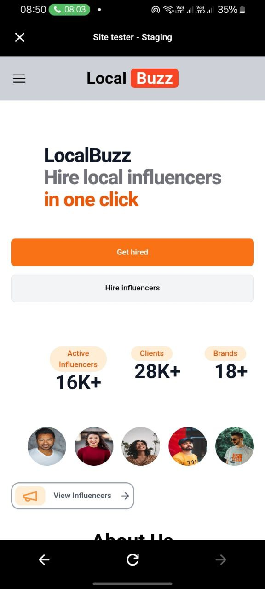
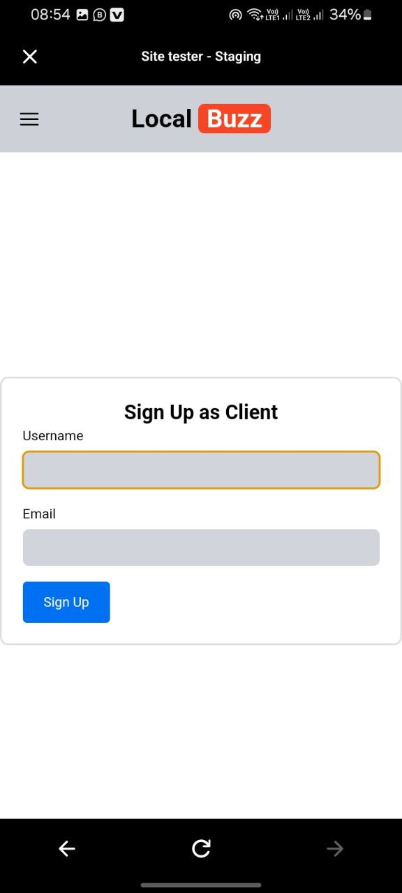
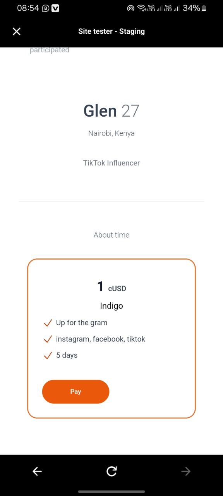
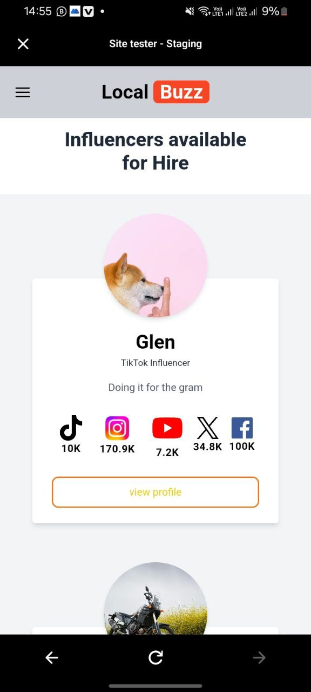

  
  
  # LocalBuzz

## Overview

LocalBuzz is a Web3 platform designed to connect micro-influencers with businesses of all sizes. LocalBuzz offers a streamlined and effective way for businesses to leverage the power of community-focused advertising through micro-influencers. Our platform ensures transparency, security, and efficiency by utilizing blockchain technology.

## Who We Are

LocalBuzz aims to bridge the gap between businesses and micro-influencers, enabling cost-effective and highly targeted marketing campaigns. Our mission is to provide a seamless connection between businesses and micro-influencers, promoting community engagement and personalized advertising.

## Getting Started

<a href="https://local-buzz-plum.vercel.app/">
    Visit website
  </a>
<a href="https://youtu.be/YNLyCWC1Uvs">
  Watch Demo Video
</a>

### Prerequisites

- Ensure you have a modern web browser.
- An internet connection.

### Installation

1. Visit the LocalBuzz website.<a href="https://local-buzz-plum.vercel.app/">
    Here
  </a>
2. Register as an influencer or a client.

### Using LocalBuzz

1. **For Influencers:**
   - Create your service packages.
   - Set your prices and describe your services.
   - Publish your packages for businesses to see.
2. **For Businesses/individuals:**
   - Browse available influencer packages.
   - Select and purchase the package that best fits your marketing needs.
   - Collaborate with influencers to promote your products or services.

### Redeeming Buzz Tokens

- Accumulate Buzz Tokens by purchasing packages.
- Redeem your Buzz Tokens for cUSD through your LocalBuzz account.

## Project Workflow

### Registration

- Users register as either an influencer or a client.

### Influencer Package Creation

- Influencers create packages detailing their services and pricing.

### Client Purchase

- Clients interested in a package can purchase it directly on the platform, indicating payment for the service.

### Rewards

- Users earn 5% of each package purchased as Buzz Tokens,which can be redeemed for cUSD.

## Feedback and Support

We value your feedback to help improve LocalBuzz. For any questions, issues, or suggestions, please contact us at jeffianmuchiri24@gmail.com.

Thank you for choosing LocalBuzz to connect with micro-influencers and enhance your marketing campaigns!
